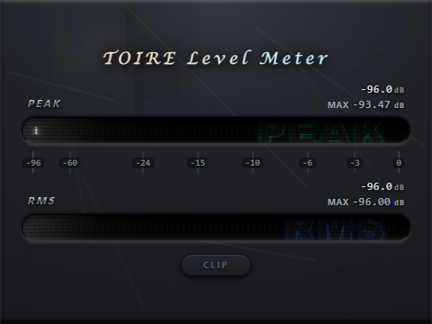

# TOIRE-LevelMeter

JUCE 8 C++ 音频电平表插件（VST3 / Standalone）。界面由 WebView2 渲染。



## 下载安装

从 [Releases](https://github.com/KianaMirayi/TOIRE-LevelMeter/releases/latest) 下载安装包，双击即可。

- 安装前请**先完全关闭 DAW**（Cubase / Studio One / Reaper 等），否则文件被占用会装不上
- 需要 64 位 Windows 10（1809 及以上）或 Windows 11
- 系统缺少 Microsoft WebView2 运行时的话，安装程序会检测并自动联网安装
- 安装包未做代码签名，首次运行 Windows 可能提示「已保护你的电脑」，点「更多信息」→「仍要运行」

安装位置：`C:\Program Files\Common Files\VST3\TOIRE Level Meter.vst3`

## 功能

- **四值电平检测**：瞬时 Peak、Peak Hold、RMS、RMS Hold
- **平滑衰减**：暂停 / deactivate / bypass 时所有电平值平滑归零（~1.6s）
- **打开即用**：界面加载期间显示同底色占位面板，全程无白屏或透明空窗；窗口出现到界面可见约 0.6–0.8 秒

## 架构

```
Source/
├── DSP/
│   ├── PluginProcessor.cpp/h    # 音频处理器
│   ├── PluginEditor.cpp/h       # WebView2 编辑器（30Hz Timer → JS）
│   ├── WebViewPrewarm.cpp/h     # 后台预热 WebView2 环境
│   └── LevelMeter/
│       └── MeterComponent.cpp/h # 纯 DSP 电平计算（lock-free atomic）
└── Bridge/
    └── WebViewBridge.cpp/h      # 早期预留的通信桥，未参与构建

Resources/webui/
    └── index.html               # WebUI

installer/                       # Windows 安装包（Inno Setup）
```

## 数据流

```
音频线程                         消息线程（30Hz）
────────                        ──────────
processBlock()                  timerCallback()
  ├─ meterData.setLatestPeak()    ├─ meterData.getPeak()      atomic →
  ├─ meterData.updatePeakHold()   ├─ meterData.getPeakHold()  atomic →
  ├─ meterData.updateRmsHold()    ├─ meterData.getRms()       atomic →
  ├─ meterData.processRms()       ├─ meterData.getRmsHold()   atomic →
  └─ ++frameCounter               ├─ frameCounter             检测暂停
                                  └─ emitEventIfBrowserIsVisible("levelData", [p, pH, r, rH])
```

## 构建

```bash
# 配置（MSVC）
cmake -B build -G "Visual Studio 17 2022"

# 编译 Debug
cmake --build build --config Debug

# 编译 Release
cmake --build build --config Release
```

VST3 自动安装到 `C:\Program Files\Common Files\VST3\`。

### 依赖

- JUCE 8（路径由 `CMakeLists.txt` 中的 `add_subdirectory` 指定，需与本项目同级）
- **Microsoft WebView2 运行时**：Windows 11 已内置；Windows 10 多数机器需要单独安装
- 构建期需要 `Microsoft.Web.WebView2` NuGet 包（提供 SDK 头文件与 `WebView2Loader.dll`）

## 生成安装包

装好 [Inno Setup 6](https://jrsoftware.org/isdl.php)，然后：

```powershell
powershell -ExecutionPolicy Bypass -File installer\fetch-deps.ps1   # 拉取 WebView2 引导程序与中文语言包
cmake --build build --config Release
& "$env:LOCALAPPDATA\Programs\Inno Setup 6\ISCC.exe" installer\TOIRE-LevelMeter.iss
```

产物在 `dist\`。

## 已知限制

- **启动耗时**：窗口出现到界面可见约 0.6–0.8 秒。其中 WebView2 创建控制器与首次合成约占 400ms，
  属于 WebView2 架构的固有成本，插件侧无法进一步压缩；可见的白屏 / 透明空窗问题已消除
- **仅支持立体声**：`isBusesLayoutSupported` 限制为 stereo ↔ stereo
- **仅 Windows**：WebView 层基于 WebView2，macOS 需要改用系统的 WKWebView 才能构建
